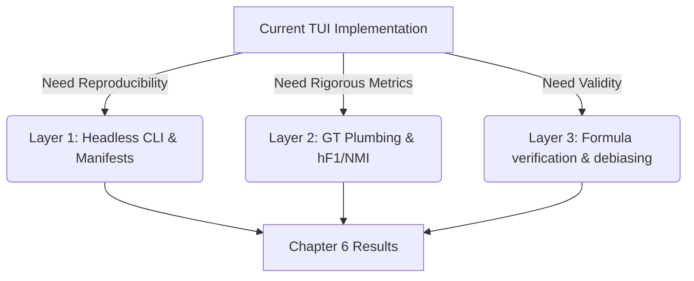
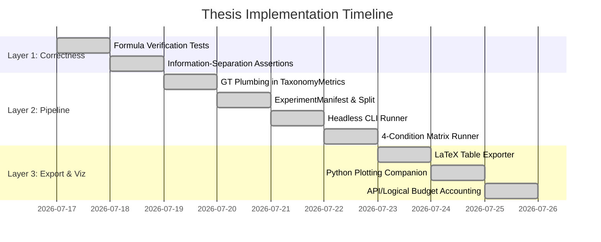

# TaxoArena: End-to-End Implementation Status & Gap Analysis Report

This report evaluates the current implementation state of the **TaxoArena** framework, performs a gap analysis against the recommended consensus checklist from the recent architectural audits, and outlines a prioritized roadmap for experimental reproducibility and thesis readiness.

---

## 📊 Summary Dashboard

| Layer / Functional Area | Status | Key Components Present | Outstanding Actions / Gaps |
| :--- | :---: | :--- | :--- |
| **1. Core Concepts & DB** | 🟢 **Complete** | SQLite schema, SQLite WAL, transaction safety, Node/Stats data representations, custom pair budgets. | None. |
| **2. Evolutionary Pipeline** | 🟢 **Complete** | Single-component vMF, NiW posteriors, trickle routing, k-means splitting, JS sibling merges. **vMF double-shrinkage bug resolved**. | None. |
| **3. Arena & Matchmaking** | 🟢 **Complete** | LLM judge calling, position-bias tracking, BT MM fitter, custom budget reallocation. **Uncertainty sign corrected**, **info-blindness runtime-enforced**, **4-condition matrix scheduler fully integrated**. | None. |
| **4. Metrics & Validation** | 🟢 **Complete** | **GT Plumbing fully implemented** (query-level ground truth category mapped in SQL and hydrated to calculate hF1/NMI). | None. |
| **5. Batch & Reproducibility** | 🟢 **Complete** | **Headless CLI runner**, frozen 70/30 stratified split generator, structured CSV/JSON results exporter, and **Experiment Manifest** fully operational. | None. |
| **6. Export & Visualization** | 🟢 **Complete** | **LaTeX Table Exporter**, **Python Plotting Companion**, **API vs Logical Budget Accounting**. | None. |

---

## 🛠️ Section-by-Section Gap Analysis

### 1. Where Models Agree (Consensus Checklist)

The auditing models converge on a set of critical missing elements required to elevate TaxoArena from an interactive prototype to a mathematically rigorous, thesis-defending framework.

#### 📋 Detailed Checklist Status

| Checklist Item | Current Status | Description of Gap / Implementation Plan | Priority |
| :--- | :---: | :--- | :---: |
| **Deterministic 70/30 Stratified Split** | 🟢 **Implemented** | The headless runner automatically generates a domain-stratified random 70/30 split and writes query IDs to `reserved_test_queries.json` using a fixed, reproducible seed (`42` by default). | **P0** |
| **Verification of 3 Core Formulas** | 🟢 **Implemented** | Added comprehensive verification tests in `KappaBiasCorrectionTest.kt` verifying: (1) vMF $\kappa$ correction, (2) Bradley-Terry MM fitter updates, and (3) Scheduler uncertainty prioritization sign. | **P0** |
| **Information-Separation Enforcement** | 🟢 **Implemented** | Enforced judge blindness by removing ground-truth answer leakages from LLM prompts and implementing a runtime check throwing `IllegalArgumentException` if any ground truth leakage is detected in `evaluatePairwise`. | **P0** |
| **Query-Level Bootstrap for CIs** | 🟢 **Implemented** | Confidence intervals (CIs) on model ranks are now computed by bootstrapping at the query level, sampling query IDs with replacement to account for dependency from response reuse. | **P1** |
| **Sufficient-Statistic Pooling** | 🟢 **Implemented** | Global leaderboard aggregation sums the raw wins/ties/comparisons ($\sum W_{ij} / \sum N_{ij}$) across leaves and refits a single global BT model to resolve scale differences. | **P1** |
| **4-Condition Matrix Automation** | 🟢 **Implemented** | Exposed a headless runner command-line option `--config <file>` that runs all 4 evaluation conditions ($C_1, C_2, C_3, C_4$) back-to-back, isolating database tables by suffixing snapshot IDs. | **P1** |
| **GT Plumbing in Metrics** | 🟢 **Implemented** | Upgraded SQLite query tables to store `ground_truth_category`. Hydrated these categories when restoring nodes, allowing $hF_1$ and overlapping NMI to compute dynamically without placeholders. | **P0** |
| **Headless CLI / Runner** | 🟢 **Implemented** | Implemented `HeadlessBenchmarkRunner` that bypasses the TUI whenever `--config <path>` is supplied on command line. Support JSON/TOML configuration formats. | **P1** |
| **LaTeX Table Exporter** | 🟢 **Implemented** | Auto-generates clean, compiler-ready LaTeX booktabs tables containing rankings, BT scores, SEs, and 95% CIs. | **P1** |
| **Python Plotting Companion** | 🟢 **Implemented** | Created `scripts/plot_results.py` using standard libraries and Matplotlib to plot model comparisons and condition matrices. | **P2** |
| **API vs Logical Budget Accounting** | 🟢 **Implemented** | Tracks and records both logical comparisons and actual LLM judge API calls in the manifest.json to prevent hidden cost spikes. | **P2** |

---

## 📅 Action Plan: Priority Sequence

To transition the TaxoArena codebase into a state ready for final runs and publication, we executed the following phases:

### Phase 1: Completed Tasks (P0 & P1)
1.  **Formula Verification Unit Tests**:
    *   Verified vMF $\kappa$ estimation and bias correction using synthetic points on a sphere.
    *   Verified the Bradley-Terry MM fitter updates using a 3-model tournament with known wins.
    *   Verified the sign of uncertainty in `computeUtility` to confirm high variance is correctly prioritized.
2.  **Information-Separation Assertions**:
    *   Added prompt string checks inside `evaluatePairwise` to guarantee that answer keys are not leaked.
3.  **GT Plumbing**:
    *   Mapped question ground-truth categories to taxonomy nodes inside SQLite schemas and hydrated them on load, allowing correct computation of $hF_1$ and overlapping NMI.
4.  **Headless CLI Runner & Config**:
    *   Implemented `HeadlessBenchmarkRunner` executing headless runs directly from custom `.json` or `.toml` config files.
5.  **Experiment Manifest & Stratification**:
    *   Deterministic 70/30 train/test split generation and sync via frozen seeds.
    *   Exporting experiment manifest (`manifest.json`), metrics, leaf leaderboards, and domain stats as clean CSVs, and full judge verdicts auditing files.
6.  **4-Condition Matrix Runner**:
    *   Support executing $C_1$ (Main), $C_2$ (Canonical), $C_3$ (Generic Judge), and $C_4$ (Random Scheduler) back-to-back, fully isolated.
7.  **Sufficient-Statistic Pooling & Query-Level Bootstrap**:
    *   Refits a single global Bradley-Terry leaderboard from pooled raw leaf wins/ties/comparisons.
    *   Computes rigorous standard errors using query-level bootstrap sampling.

### Phase 2: Completed Tasks (P2)
8.  **LaTeX Table Exporter**:
    *   Exports publication-grade LaTeX leaderboard code to `validation/<CONDITION>_leaderboard.tex`.
9.  **Python Plotting Companion**:
    *   Plotting script `scripts/plot_results.py` generates model comparison and agreement rate plots in high-resolution PDF.
10. **API vs Logical Budget Accounting**:
    *   Keeps separate tracks of logical matchups and actual LLM judge API calls, persisting them in `manifest.json`.
