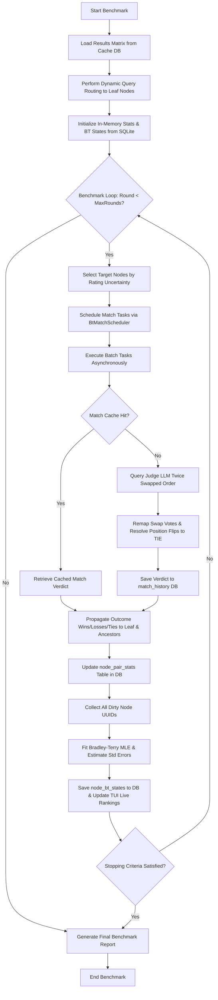

# TaxoArena Benchmark Flow Report

This report provides a complete, step-by-step description of the execution flow of the TaxoArena Benchmark system, detailing the database transactions, scheduling, pairwise remapping logic, and the Bradley-Terry rating propagation.

---

## 1. High-Level Flow Chart

The diagram below outlines the sequential flow of the benchmark from configuration inputs to the final Bradley-Terry score output.



---

## 2. Core Execution Steps

### Step 2.1: Initialization & Matrix Setup
* **Trigger**: The user starts the benchmark in the TUI (`BenchmarkPanel.kt`) or programmatically via `TaxonomyBenchmarkService.runBenchmark(...)`.
* **Database Lookup**:
  * Queries the `eval_results` table in `mmlu_pro_dataset_cache_v2.db` using `ModelEvalStore.getResultsMatrix(models, category, queryLimit)`.
  * Loads a matrix of type `Map<Int, Map<String, ModelEvalResult>>` containing precomputed model answers, correctness flags, and raw outputs for the selected category.
* **Graph Retreival**:
  * Loads the active graph snapshot hierarchy via `TaxonomyService.getGraph()`.

### Step 2.2: Dynamic Query Routing
* For each query in the matrix:
  * Looks up or generates the question embedding using `EmbeddingCache`.
  * Routes the query embedding down the graph from the root node to the matching leaf node(s) using `TaxonomyOperations.routeQuery(...)`.
  * Populates `nodeToQueries: Map<String, List<Int>>` which maps leaf node UUIDs to their matched question IDs.

### Step 2.3: In-Memory Cache Loading
* The service reads all existing stats from the `ratings.db` to resume or build on previous runs:
  * **Pair Stats**: `rankingService.getAllNodePairStats(snapshotId)` $\rightarrow$ populated into `pairStatsMap: MutableMap<String, MutableList<NodePairStats>>`.
  * **BT States**: `rankingService.getAllBtStates(snapshotId)` $\rightarrow$ populated into `btStates: MutableMap<String, NodeBtState>`.

---

## 3. The Iterative Round Loop

In each round ($round \ge 0$), the following processes occur:

### Step 3.1: Target Node Selection
* Filters leaf nodes that have children-free structures and contain at least one query.
* Sorts them descending by the uncertainty (average standard error) of their Bradley-Terry model ratings.
* Takes the top 5 most uncertain leaf nodes to focus the benchmark on resolving ratings where information is lowest.

### Step 3.2: Match Scheduling
* `BtMatchScheduler.selectNextBatch` scans the selected target nodes.
* For each node, it generates all candidate model pairs ($M_A$ vs $M_B$).
* For each pair:
  * Calculates the number of comparisons needed (up to `queriesPerPair = 20`, extendable up to 100).
  * Computes the number of already evaluated queries (`evaluatedCount`) from `pairStatsMap[node.id]`.
  * Slices the node's routed queries:
    $$\text{querySlice} = \text{availableQueries.keys.drop(evaluatedCount).take(minOf(needed, BATCH\_STEP\_SIZE))}$$
  * If the slice is not empty, it adds a `BtMatchTask` to the batch.
* The scheduler caps the batch size at the specified parallelism setting.

### Step 3.3: Pairwise Evaluation Flow (Position-Bias Countering)
For each task in the scheduled batch, the service runs the evaluation:

```
[Cache Lookup]
Check if match exists in match_history: (snapshotId, query, modelA, modelB)
   |
   +---> [Cache Hit] ---> Load verdict, skip LLM calls.
   |
   +---> [Cache Miss] ---> Perform LLM Evaluation:
                            Trial 1: Prompts Judge with (Model A: traceA, Model B: traceB)
                            Trial 2: Prompts Judge with (Model A: traceB, Model B: traceA)
                            Parse & Remap votes.
```

#### Vote Remapping & Verdict Resolution:
* Votes from the structured JSON output (`winner = "Model A"` or `"Model B"`) are mapped:
  * **Trial 1 (Normal)**: `vote1` is `"Model A"` or `"Model B"` (or `"TIE"` if invalid/tie).
  * **Trial 2 (Swapped)**: `vote2` is remapped (if Trial 2 voted `"Model A"`, it re-maps to `"Model B"`; if `"Model B"`, it re-maps to `"Model A"`).
* **Verdict Decision Matrix**:
  * **Consistent Winner (`vote1 == vote2`)**: The consistent model is returned as the winner (`"Model A"`, `"Model B"`, or `"TIE"`).
  * **Split Verdict / Position Flip (`vote1 != vote2`)**: The vote changed depending on the order in the prompt. This indicates position bias and is resolved immediately as a **`"TIE"`**.

---

## 4. Rating Propagation & Fitting

### Step 4.1: Node Stats Propagation
* Once the verdict (`outcome`) is resolved, `propagateOutcome` updates the stats:
  * Wins and losses are mapped:
    * `"Model A"` winner $\rightarrow$ `winsA = 1.0`, `winsB = 0.0`.
    * `"Model B"` winner $\rightarrow$ `winsB = 1.0`, `winsA = 0.0`.
    * `"TIE"` winner $\rightarrow$ `winsA = 0.5`, `winsB = 0.5`.
  * Loops over the leaf node and **all of its ancestors** (`node.allAncestors()`).
  * Increments `totalComparisons` by 1 and adds the win fractions to `winsA`/`winsB` in `node_pair_stats`.
  * Saves the stats to the SQLite database via `rankingService.saveNodePairStats(stats, snapshotId)`.

### Step 4.2: Bradley-Terry MLE Fit
* Marks all updated nodes and their ancestors as `dirtyNodes`.
* For each dirty node UUID:
  * Reloads the complete list of node pair stats from SQLite.
  * Performs Bradley-Terry Maximum Likelihood Estimation (MLE) using the Weng-Lin / OpenSkill solver to calculate new rating strengths (`btScores`).
  * Computes standard errors (`stdErrors`) to determine rating confidence.
  * Saves the updated model scores and uncertainties to the `node_bt_states` table in SQLite.
  * Updates the in-memory `btStates` map.

---

## 5. Stopping Criteria

At the end of each round, `BtStoppingPolicy.shouldStop` checks the current progress:
1. **Minimum comparisons**: Check if all model pairs have been evaluated at least `minComparisons` times across the active nodes.
2. **Stability / Separation**: Check if the top model's rating is separated from the runner-up by a significant margin relative to the standard error.
3. **Max Rounds**: Stops if the loop reaches `maxRounds = 20`.

If any condition is satisfied, the loop terminates and compiles the final `ArenaBenchmarkReport` containing ratings, full pair detail statistics, and correctness agreements.
