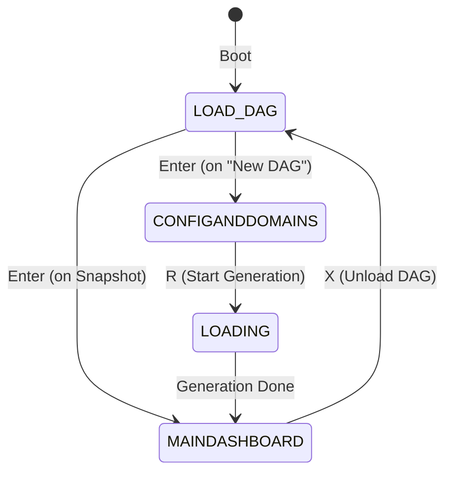

# TaxoArena TUI Layout & Navigation Reference

This document provides a precise, comprehensive reference of all terminal layouts, views, user flows, and keyboard hotkeys. Use this as a mapping to locate relevant files and plan adjustments.

---

## 1. Screen Layout States (`StartupState`)

The TUI cycles through four primary screens depending on the lifecycle phase:



---

## 2. Layout & Navigation Matrix

### Screen A: Welcome screen (`StartupState.LOAD_DAG`)
* **Layout**: Left-hand **Snapshot List** (45% width) + Right-hand **Snapshot Summary** panel.
* **Controller**: [WelcomeKeyHandler.kt](file:///Z:/FAC/TUBerlin/THESIS/TaxoArena/src/main/kotlin/taxonomy/tui/controller/keys/WelcomeKeyHandler.kt)
* **Actions & Navigation**:
  * `Up` / `Down` (or `k` / `j`): Selects welcome options:
    * Option 0: *New DAG* (Starts fresh configuration).
    * Option $1 \dots N$: Existing saved snapshots.
  * `Enter`: Confirm selection.
    * If *New DAG* $\to$ Transitions to `CONFIGANDDOMAINS`.
    * If snapshot $\to$ Transitions to `LOADING` screen to unpack state, then boots `MAINDASHBOARD`.
  * `D`: Deletes the highlighted snapshot (with a safety prompt).
  * `Q` / `Esc`: Exits the application.

---

### Screen B: Configuration screen (`StartupState.CONFIGANDDOMAINS`)
* **Layout**: Split into two sub-panels via `ConfigSubPanel`:
  1. **Domains Selection Panel**: Toggle which MMLU-Pro domain subcategories are active.
  2. **Settings Panel**: Configure hyperparameter items (e.g. LLM provider, max tree depth, epsilon).
* **Controller**: [ConfigKeyHandler.kt](file:///Z:/FAC/TUBerlin/THESIS/TaxoArena/src/main/kotlin/taxonomy/tui/controller/keys/ConfigKeyHandler.kt)
* **Actions & Navigation**:
  * `Tab`: Switch focus between **DOMAINS** list and **SETTINGS** list.
  * In **DOMAINS**:
    * `Up` / `Down` (or `k` / `j`): Navigate category entries.
    * `Space`: Toggle selection of the highlighted category.
    * `A`: Select all domains / `N`: Deselect all domains.
  * In **SETTINGS**:
    * `Up` / `Down` (or `k` / `j`): Navigate configuration rows.
    * `Enter`: Starts inline editing of value (or cycles choices for enum parameters).
    * `Esc`: Cancel editing.
  * `D`: Connect to HuggingFace and download dataset queries.
  * `R`: Starts the statistical taxonomy DAG generation (`generateDag` pipeline).
  * `Esc` / `Q`: Returns back to the Welcome screen.

---

### Screen C: Main dashboard workspace (`StartupState.MAINDASHBOARD`)
* **Layout**: Split vertically into two columns via [DashboardLayout.kt](file:///Z:/FAC/TUBerlin/THESIS/TaxoArena/src/main/kotlin/taxonomy/tui/app/DashboardLayout.kt):
  * **Left Column (50% Width)**: The **DAG Explorer** (Topology Panel).
  * **Right Column (50% Width)**: The **Analysis Hub** (swaps view modes depending on `AnalysisMode`).
* **Actions & Navigation**:
  * `Tab`: Toggle panel focus between the Left Column (`FocusPanel.TOPOLOGY`) and the Right Column (`FocusPanel.ANALYSIS_HUB`).
  * `M` / `C` / `A` / `B` / `T` / `S`: Swap the Right Column view mode (see below).
  * `X`: Unloads the active DAG and returns to the Welcome screen.

```
┌──────────────────────────────────────┬─────────────────────────────────┐
│                                      │                                 │
│  LEFT COLUMN: DAG EXPLORER           │  RIGHT COLUMN: ANALYSIS HUB     │
│  (Always active)                     │  (Swaps modes via hotkeys)      │
│                                      │                                 │
│  Displays the taxonomy Tree Table.   │  • [M] Metrics Diagnostics      │
│  Traverse nodes using arrow keys.    │  • [C] Config Details           │
│                                      │  • [A] LLM-Judge Battle Arena   │
│  Focus code: TopologyPanel.kt        │  • [B] Benchmark Controller     │
│                                      │  • [T] Batch Trickle Routing    │
│                                      │  • [S] Snapshots Management     │
│                                      │                                 │
└──────────────────────────────────────┴─────────────────────────────────┘
```

#### Left Column: DAG Explorer details
* **Controller**: [TopologyKeyHandler.kt](file:///Z:/FAC/TUBerlin/THESIS/TaxoArena/src/main/kotlin/taxonomy/tui/controller/keys/TopologyKeyHandler.kt)
* **Actions**:
  * `Up` / `Down` (or `k` / `j`): Navigate tree nodes.
  * `L` / `Right`: Expand selected domain.
  * `H` / `Left`: Collapse selected domain.
  * `Space`: Toggle domain node active state.
  * `Enter`: Inspect node (forces Right Column into `AnalysisMode.NODE_DETAIL`).
  * `R`: Triggers batch LLM-judge generation for this node specifically.

---

## 3. Sub-Panel Modes & Detailed Interaction Flows

Tapping a mode hotkey when focus is in the dashboard shifts the Right Column into that mode. Below are the precise step-by-step interactions and states inside each sub-panel:

### A. Benchmark Panel (`AnalysisMode.BENCHMARK` / Hotkey: `B`)
Renders [BenchmarkPanel.kt](file:///Z:/FAC/TUBerlin/THESIS/TaxoArena/src/main/kotlin/taxonomy/tui/features/benchmark/BenchmarkPanel.kt). It governs batch model-eval evaluations and taxonomy checks.

#### Step 1: Benchmark Type Selector Screen
* **Views**:
  * `[ARENA]`: Multi-model pairwise evaluation over MMLU-Pro.
  * `[TRICKLE]`: Batch routing accuracy test over reserved test query set.
* **Controls**:
  * `Up` / `Down` (or `k` / `j`): Moves selection cursor between the options.
  * `Enter`: Confirms type selection.

---

#### Step 2a: TRICKLE Benchmark Screen
* **Initial View**: Shows description "Batch routing accuracy test over the reserved test queries. Press B to start."
* **Controls**:
  * `B`: Initiates the test runner (`runBatchTrickle` effect).
  * `Q` / `Esc`: Returns to the Step 1 type selector.
* **Running View**: Displays progress string ("Running batch trickle test...").
* **Results View**: Prints summary metrics:
  * *Total queries*, *Top-1 accuracy*, *Any-match acc*, *Macro-F1*, *Mean leaf purity*, *Mean depth*, and *No-match rate*.
  * *Per-domain F1* table (sorted by support volume for top 10 categories).
  * `B` re-runs the test; `Q` returns to selector.

---

#### Step 2b: ARENA Parameters Configuration Screen
If `ARENA` was selected, the TUI renders a configuration menu split into 4 sections:
1. **MODELS**: Selected models to evaluate (requires $\ge 2$).
   * Tapping **`O`** opens the **Eval Ingestion Picker** (`EvalCatalogPicker` overlay):
     * Displays cached model output `.json` / `.zip` files.
     * `Up` / `Down`: Move file cursor.
     * `Space`: Toggles model selection.
     * `Enter`: Ingests highlighted files into the active TUI environment (progress is shown via progress bars).
     * `D`: Download raw MMLU-Pro model outputs from remote repository.
     * `Q`: Exit picker overlay.
2. **DOMAINS**: Choose categories/domains to restrict evaluations (default is all).
3. **OPTIONS**: Customize run options.
   * `Up`/`Down` to navigate rows:
     * *Query limit*: Maximum query count to evaluate. Tapping `Enter` enables inline numeric input. Type the limit and tap `Enter` to commit, or `Esc` to discard.
     * *Reserved-only*: If set to `yes`, limits the pool to reserved queries. Tap `Enter` to toggle yes/no.
     * *Update rankings*: If set to `yes`, feeds comparison outputs to OpenSkill leaderboard. Tap `Enter` to toggle.
4. **START**: Validation block.
   * If $\ge 2$ models are selected, displays "▶ Run benchmark (Enter)". Tapping `Enter` launches the runner.
   * Otherwise, displays warning "Select >=2 models first".

---

#### Step 3: Arena Benchmark Run View (Live Screen)
When the benchmark starts, it replaces the parameter config screen with a live evaluation interface. Tapping **`V`** toggles between two live presentation views:
1. **`SUMMARY` View**:
   * Displays overall counts (e.g. `Progress: 45/200 (22%)`).
   * Displays running metrics: `Agreement` rate and `Coverage` rate.
   * Renders a live horizontal bar chart representing each model's current accuracy on evaluated queries.
2. **`STREAM` View**:
   * Prints the text of the query currently being processed.
   * Renders a historical scrolling log of the 10 most recent question results, tracking how each model performed (e.g., `• college_physics | GT:A | model_1:A✓ model_2:B✗`).

---

### B. LLM-Judge Battle Arena Panel (`AnalysisMode.ARENA` / Hotkey: `A`)
Renders [ArenaPanel.kt](file:///Z:/FAC/TUBerlin/THESIS/TaxoArena/src/main/kotlin/taxonomy/tui/features/arena/ArenaPanel.kt). Allows direct manual matchups between models.

* **Leaderboard Overlay**: Tapping **`L`** toggles a scrollable view of the global leaderboard (loaded agents ranked by OpenSkill parameters `μ` and `σ`). Scroll through the list using **`W` / `S`** keys.
* **Matchup Parameters Sequence**:
  1. Prompts for **Model A** name input (press `Enter` to commit).
  2. Prompts for **Model B** name input (press `Enter` to commit).
  3. Prompts for matchup question:
     * If in `PRECOMPUTED` mode: Prompts for a numerical `question_id`.
     * If in `LIVE` mode: Prompts for a raw `Query` text.
* **Execution**: Once submitted, runs a pairwise battle and prints:
  * The selected node path the query was routed through.
  * The judge's generated prompt and rubric.
  * Step-by-step reasoning traces and final preference decision.

---

### C. Snapshots Panel (`AnalysisMode.SNAPSHOTS` / Hotkey: `S`)
Renders [SnapshotPanel.kt](file:///Z:/FAC/TUBerlin/THESIS/TaxoArena/src/main/kotlin/taxonomy/tui/features/snapshots/SnapshotPanel.kt). Saves and loads DAG configurations.

* **Controls**:
  * `Up` / `Down` (or `k` / `j`): Selects snapshot.
  * `L` or `Enter`: Loads the selected snapshot state (restores configuration, Graph nodes, and metrics history).
  * `D`: Deletes the snapshot file.
  * `N`: Save current DAG state. Opens a prompt asking for a short text description. Type and press `Enter` to write state to disk.
  * `R`: Rename the description of the selected snapshot.

---

## 4. Global Keys (Available on any screen)

* **`?`**: Toggles the keyboard help reference sheet overlay.
* **`Ctrl-C`**: Safely restores terminal streaming variables and shuts down the JVM immediately.
