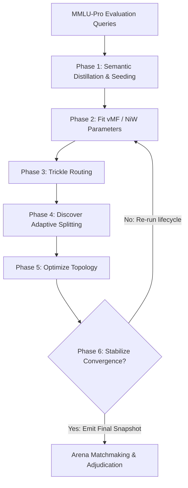

# Evolutionary Pipeline: End-to-End Lifecycle

This document describes the end-to-end evolutionary pipeline of **TaxoArena**, showing how raw evaluation queries are ingested, structured, routed, split, optimized, and stabilized into a self-organizing knowledge taxonomy.

---

## 1. Pipeline Architecture Diagram

The lifecycle of the taxonomy engine is orchestrated as a series of distinct phases executed in a loop. Below is a conceptual visualization of this architecture:

---

## 2. Detailed Execution Phases

The execution pipeline is coordinated by [TaxonomyEngine](file:///Z:/FAC/TUBerlin/THESIS/TaxoArena/src/main/kotlin/taxonomy/TaxonomyEngine.kt) and is divided into six logical phases:

### Phase 1: Semantic Distillation & Seeding
Raw natural language queries are linguistically noisy, containing conversational filler and question markers. Distillation stabilizes the high-dimensional space:
*   **Semantic Distillation**: An LLM extracts $3 \dots 5$ core technical keywords (e.g., "value chain, primary activities") from raw queries.
*   **Denoising**: Distilled signatures are embedded using **Qwen3-Embedding**, yielding tight, stable vector clusters instead of dispersed clouds.
*   **Bootstrap Seeding**: Initial ground-truth queries are used to construct the level-1 anchor domains, establishing the fundamental branches.

### Phase 2: Fit (Context-Aware Distribution Modeling)
This phase models the statistical geometry of each domain node:
*   **vMF Fitting**: A single-component von Mises-Fisher (vMF) model is fitted to each node's local query coordinates, capturing its mean direction vector $\mu$ and concentration parameter $\kappa$.
*   **Bayesian Regularization**: A diagonal Normal-Inverse-Wishart (NiW) posterior is updated recursively from parent to child to regularize routing confidence.
*   **Execution**: Implemented in [TaxonomyFitter](file:///Z:/FAC/TUBerlin/THESIS/TaxoArena/src/main/kotlin/taxonomy/operations/TaxonomyFitter.kt). It runs parallel BFS depth-first sweeps to ensure parent parameters are resolved before children.

### Phase 3: Trickle (Top-Down Restrictive Routing)
Queries are routed from the Root down the DAG:
*   **Routing Probability**: Sibling nodes compete for queries. Sibling probabilities are computed using a log-space softmax scaled by temperature $\tau$ (default $0.5$) and regularized with Laplace smoothing.
*   **Exclusion Funnel**: Depth-decaying confidence intervals act as safety valves, narrowing the routing boundaries from $0.999 \to 0.90$.
*   **Execution**: Implemented in [TaxonomyTrickler](file:///Z:/FAC/TUBerlin/THESIS/TaxoArena/src/main/kotlin/taxonomy/operations/TaxonomyTrickler.kt). It maps queries to reached leaves that fall within `assignmentGap` of the highest leaf score.

### Phase 4: Discover (Adaptive Splitting)
When query density within a leaf exceeds a threshold $2 \times N_{min}$, it is evaluated for sub-domain creation:
*   **Bisection and Clustering**: The local query pool is projected into a lower-dimensional subspace via PCA and clustered using vMF-k-Means.
*   **Dasgupta Validation**: The potential split is audited using the Dasgupta Cost Delta ($\Delta$). A split is executed only if $\Delta > \epsilon_{separation}$.
*   **Execution**: Implemented in [TaxonomySplitter](file:///Z:/FAC/TUBerlin/THESIS/TaxoArena/src/main/kotlin/taxonomy/operations/TaxonomySplitter.kt).

### Phase 5: Optimize (Topological Polish)
Refines the taxonomy structure to prevent complexity explosion:
*   **Pruning**: Removes starved leaf nodes (member count $< 0.2 \times \text{average sibling count}$) or empty parent nodes.
*   **Merging**: Highly similar sibling domains (JS-divergence $< \epsilon_{separation}$) are merged, and their vMF/NiW parameters blended.
*   **Cross-Linking**: Builds polyhierarchical links. If queries of a leaf node align closely with a sibling branch, a cross-link is added.
*   **Transitive Reduction**: Sweeps the DAG to delete redundant shortcut edges while preserving primary tree structure.
*   **Execution**: Implemented in [TaxonomyMerger](file:///Z:/FAC/TUBerlin/THESIS/TaxoArena/src/main/kotlin/taxonomy/operations/TaxonomyMerger.kt).

### Phase 6: Stabilize (Convergence Verification)
Verifies if the taxonomy has reached mathematical equilibrium:
*   **Volume Minimization**: Computes the Total Log Semantic Volume, which is the sum of covariance determinants ($\Lambda_N$) across all leaf nodes.
*   **Migration Stability**: The cycle terminates when query migration between domains drops to zero (or under a threshold) and the semantic volume stabilizes.
*   **Outcome**: Once stabilized, the taxonomy DAG is frozen and written to the SQLite snapshot store.

---

## 🔗 Related Code References
*   [TaxonomyEngine](file:///Z:/FAC/TUBerlin/THESIS/TaxoArena/src/main/kotlin/taxonomy/TaxonomyEngine.kt): Entrypoint for lifecycle loops.
*   [TaxonomyFitter](file:///Z:/FAC/TUBerlin/THESIS/TaxoArena/src/main/kotlin/taxonomy/operations/TaxonomyFitter.kt): Parameter estimation class.
*   [TaxonomyTrickler](file:///Z:/FAC/TUBerlin/THESIS/TaxoArena/src/main/kotlin/taxonomy/operations/TaxonomyTrickler.kt): Top-down router.
*   [TaxonomySplitter](file:///Z:/FAC/TUBerlin/THESIS/TaxoArena/src/main/kotlin/taxonomy/operations/TaxonomySplitter.kt): Split coordinator.
*   [TaxonomyMerger](file:///Z:/FAC/TUBerlin/THESIS/TaxoArena/src/main/kotlin/taxonomy/operations/TaxonomyMerger.kt): Topological optimization orchestrator.
