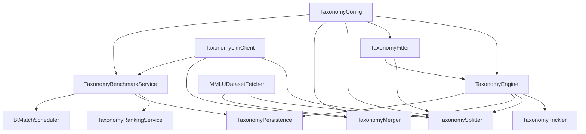

# Spring Framework Integration & Concurrency Model

This document details the software architecture of **TaxoArena**, focusing on its integration with Spring Boot, dependency injection topology, Kotlin Coroutine execution model, and execution scheduling.

---

## 1. Spring Component Dependency Graph

TaxoArena utilizes Spring Boot's dependency injection container to manage lifecycle states, configurations, and core services. The primary components are structured as `@Service` or `@Component` classes:



### Core Services
*   [TaxonomyEngine](file:///Z:/FAC/TUBerlin/THESIS/TaxoArena/src/main/kotlin/taxonomy/TaxonomyEngine.kt): Entry point service that orchestrates the self-organizing pipeline.
*   [TaxonomyFitter](file:///Z:/FAC/TUBerlin/THESIS/TaxoArena/src/main/kotlin/taxonomy/operations/TaxonomyFitter.kt): Fits spherical probability parameters.
*   [TaxonomySplitter](file:///Z:/FAC/TUBerlin/THESIS/TaxoArena/src/main/kotlin/taxonomy/operations/TaxonomySplitter.kt): Evaluates node split criteria.
*   [TaxonomyMerger](file:///Z:/FAC/TUBerlin/THESIS/TaxoArena/src/main/kotlin/taxonomy/operations/TaxonomyMerger.kt): Optimizes DAG topologies and cross-links.
*   [TaxonomyBenchmarkService](file:///Z:/FAC/TUBerlin/THESIS/TaxoArena/src/main/kotlin/taxonomy/service/TaxonomyBenchmarkService.kt): Manages active matchmaking and pairwise evaluations.
*   [TaxonomyRankingService](file:///Z:/FAC/TUBerlin/THESIS/TaxoArena/src/main/kotlin/taxonomy/service/TaxonomyRankingService.kt): Interfaces with SQLite to save match verdicts, ratings, and Bradley-Terry parameters.

---

## 2. Kotlin Coroutines Concurrency Model

Rather than relying on thread pools (such as Java's `ExecutorService`) which carry significant overhead, TaxoArena uses **Kotlin Coroutines** for high-performance concurrent execution.

### Dispatcher Routing
We segregate workloads onto specific coroutine dispatchers to prevent CPU starvation and blocking input/output (I/O) conflicts:
1.  **`Dispatchers.Default` (CPU-Bound)**:
    *   Used for PCA projection, vMF EM fitting, and Dasgupta delta computations.
    *   Example: Level-by-level parallel splitting inside `splitNodesRecursive`:
        ```kotlin
        nodesAtDepth.map { node ->
            async(Dispatchers.Default) {
                splitSingleNode(node)
            }
        }.awaitAll()
        ```
2.  **`Dispatchers.IO` (I/O-Bound)**:
    *   Used for database query executions, file logging, and network-based LLM API calls.
3.  **Dedicated Database Write Dispatcher**:
    *   A single-threaded dispatcher (`newSingleThreadContext("DB-Write")`) is used to sequentialize all write transactions to SQLite, preventing file-lock contention.

### API Parallelism Rate-Limiting
Concurrent requests to LLM APIs (for domain labeling or pairwise judging) can easily exceed server rate limits or exhaust API credits.

TaxoArena implements a concurrency throttle using a Kotlin coroutine **`Semaphore`** initialized from the system configuration:

```kotlin
private val llmSemaphore = Semaphore(config.execution.llmParallelism)

suspend fun queryModel(...) = llmSemaphore.withPermit {
    llmClient.query(...)
}
```

This ensures that no more than `llmParallelism` API calls run concurrently, suspending additional request coroutines without blocking system threads.

---

## 🔗 Related Code References
*   [TaxonomyEngine](file:///Z:/FAC/TUBerlin/THESIS/TaxoArena/src/main/kotlin/taxonomy/TaxonomyEngine.kt): Direct orchestrator using coroutines.
*   [TaxonomyConfig](file:///Z:/FAC/TUBerlin/THESIS/TaxoArena/src/main/kotlin/taxonomy/config/TaxonomyConfig.kt): Spring `@Configuration` declarations.
*   [TaxonomyBenchmarkService](file:///Z:/FAC/TUBerlin/THESIS/TaxoArena/src/main/kotlin/taxonomy/service/TaxonomyBenchmarkService.kt): Code location for LLMPermit throttling.
